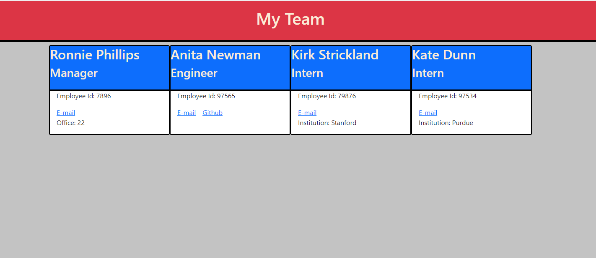

# Staff Organizer

# Table of Contents

  * [Description](#Description)
  * [Installation](#Installation)
  * [Usage](#Usage)
  * [Tests](#Testing)
  * [License](#License)
  * [Contact](#Contact)

# Description

    This is a node.js command line application that will allow team manager to create and store a team. The tool uses inquirer to generate user input and then feeds the reponses from the prompts into a website generator. This website generator creates a simple html page that the manager can reference. 
  
  [Example of website output.](index.html)

# Installation Instructions

    git clone from git@github.com:nathanrusselldev/russellStaffOrganizer.git
  
# Usage

    Use to test functionality, critique code, learn from code, or to create your own team. 
  

# Testing

    Testing available using the jest npm. 

# License

CC0

# Contact

If you have any questions or concerns I can be contacted via e-mail or github.

  * mailto:nathanrussell.it@gmail.com
  * [https://github.com/nathanrusselldev/](https://github.com/nathanrusselldev)